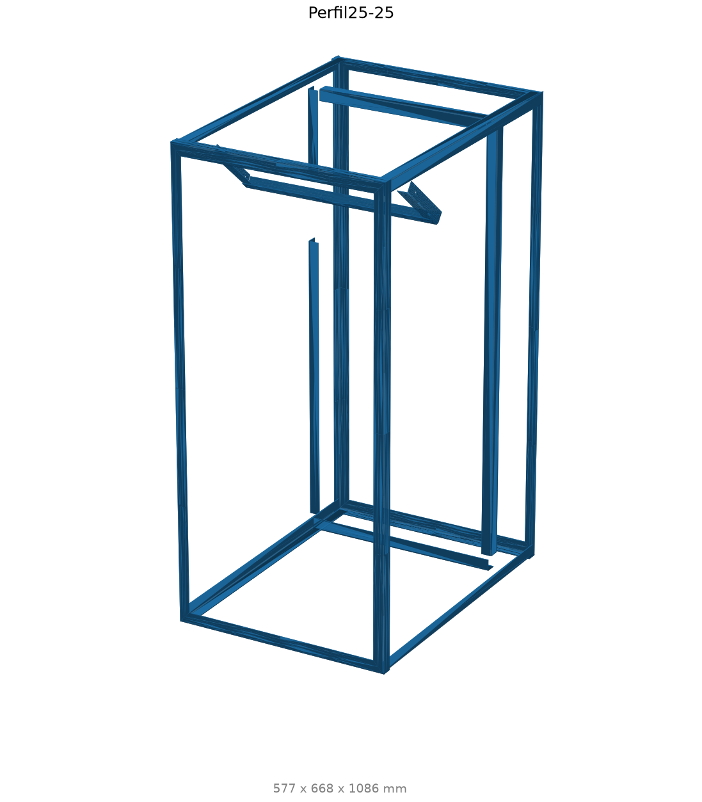
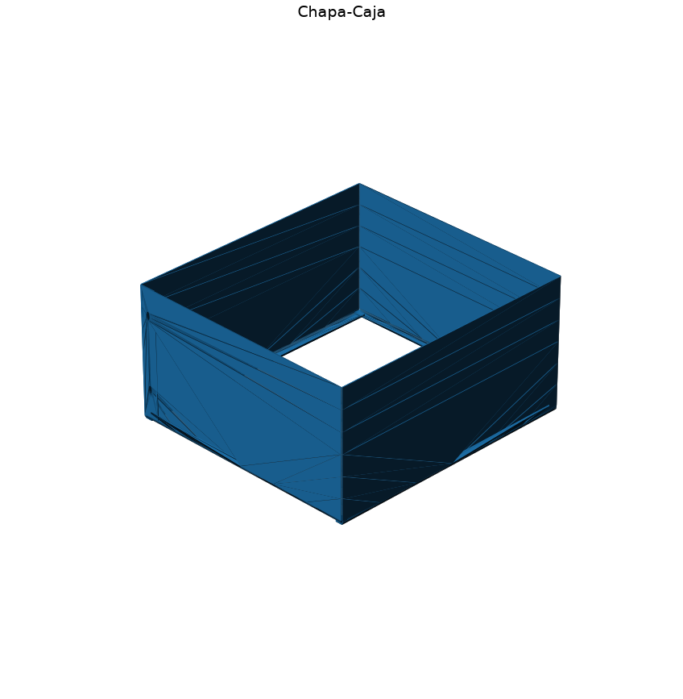
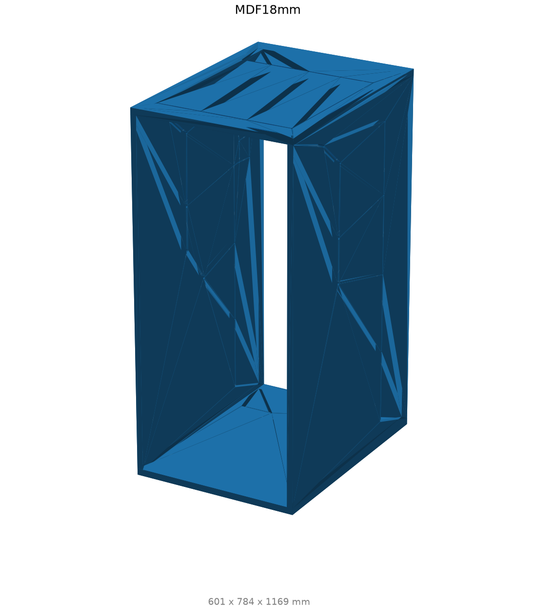
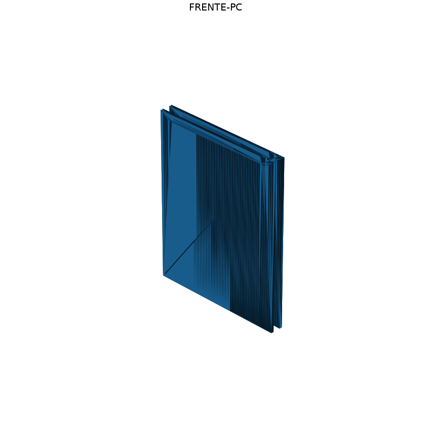
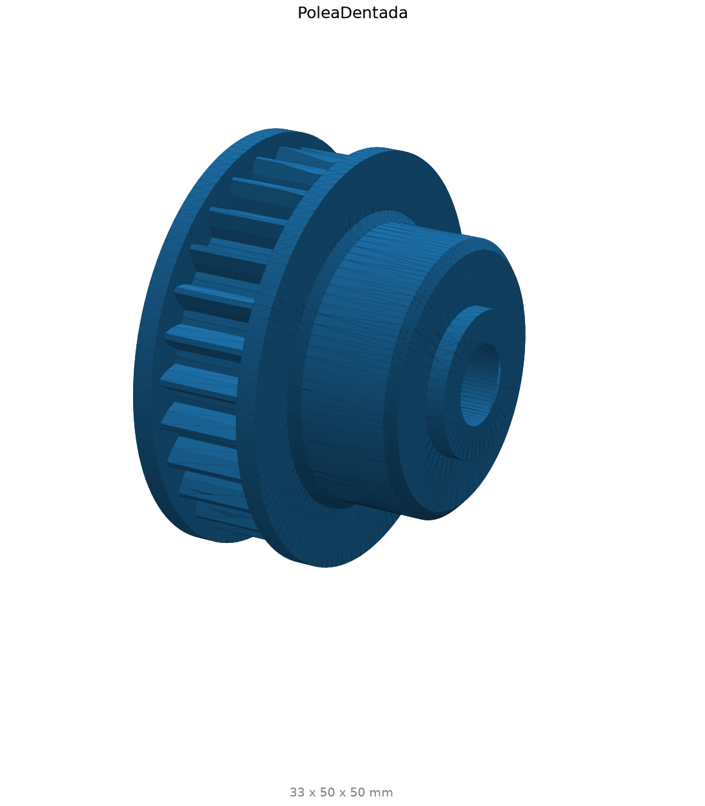
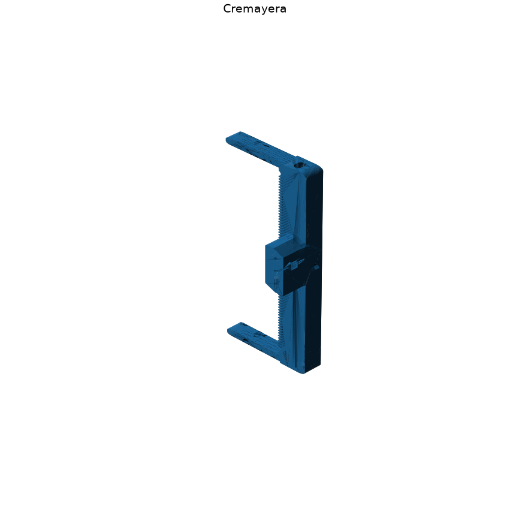
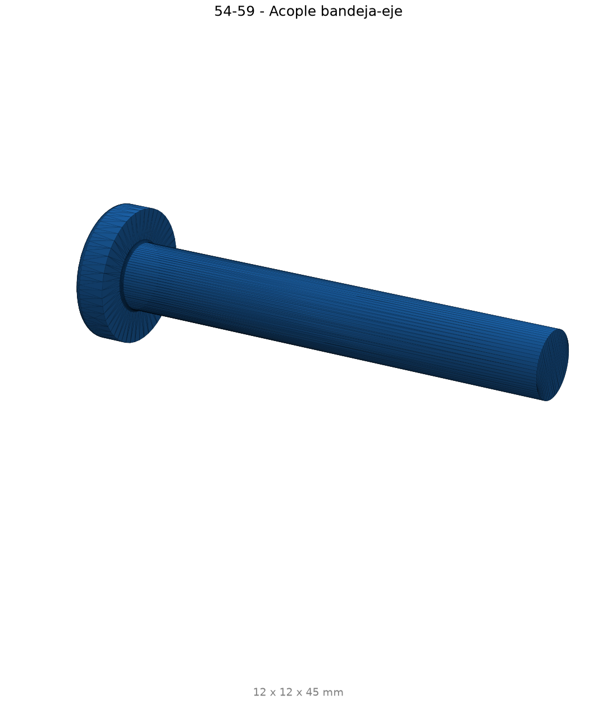

# Anexos y archivos fuente

## Archivos principales

| Archivo | Uso |
|---|---|
| `Rediseno/Incubadora-Final.3dm` | CAD maestro Rhino. |
| `Rediseno/extract_cad.py` | Genera inventario y mini-BOMs desde CAD. |
| `Rediseno/render_parts.py` | Genera renders de piezas, subconjuntos y locators. |
| `Rediseno/cad/inventario.json` | Fuente estructurada del inventario. |
| `Rediseno/cad/inventario.md` | Inventario completo para MkDocs. |
| `Rediseno/cad/resumen_componentes.md` | Mini-BOM por componente para el flujo principal. |
| `docs/img/componentes/` | Locators y subconjuntos por componente. |
| `docs/img/piezas/` | Renders individuales y conjunto. |

## Galeria de piezas

Vista isometrica del conjunto:

{ width=640 }

### Piezas mecanicas representativas

| | |
|---|---|
| { width=320 } | { width=320 } |
| { width=320 } | { width=320 } |
| { width=320 } | { width=320 } |
| { width=320 } | { width=320 } |

## Reproducir documentacion tecnica

```bash
python3 Rediseno/extract_cad.py
.venv-render/bin/python Rediseno/render_parts.py
mkdocs build --strict
```

El render usa mallas nativas de `rhino3dm`.
