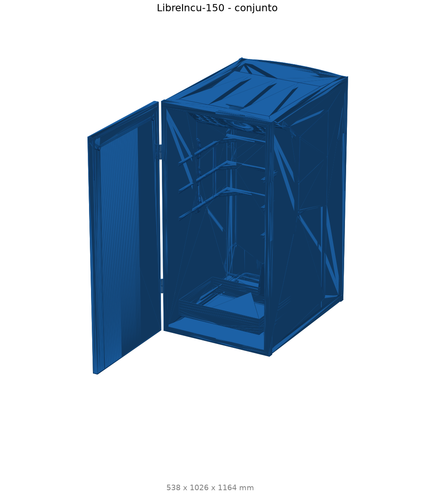

# Vista 3D y despiece

Explorá el modelo 3D de la LibreIncu-150 directamente en el navegador. Podés rotar con el mouse/tactil,
usar el boton para alternar entre **armado** y **despiece**, y hacer clic en las piezas de abajo para
ver cada una en 3D. Los numeros (`Nº`) coinciden con la tabla del [Inventario CAD](inventario.md).

!!! info "Requisitos"
    Esta pagina usa `<model-viewer>` embebido en el sitio. Necesita un navegador con WebGL.
    No aparece en el PDF. Los modelos se descargan bajo demanda; el poster PNG se muestra hasta entonces.

!!! warning "Modelos 3D = solo visualizacion"
    Los GLB se generan a partir de mallas simplificadas para web. **No usarlos para medir ni fabricar:**
    pierden detalle fino (agujeros, dientes, plegados). Las medidas y la geometria de taller estan en el
    [Inventario CAD](inventario.md) y en el CAD maestro.

## Conjunto

  

    <button id="btn-armado" class="v3d-tab active" data-mode="armado">Armado</button>
    <button id="btn-despiece" class="v3d-tab" data-mode="despiece">Despiece</button>
  

  <model-viewer id="visor-conjunto"
                src="../models/conjunto-armado.glb"
                poster="../img/piezas/_conjunto.png"
                alt="Conjunto LibreIncu-150"
                camera-controls
                camera-orbit="-60deg 22deg auto"
                auto-rotate
                reveal="auto"
                shadow-intensity="1"
                exposure="0.8">
    <button slot="hotspot-cajon" data-position="1036.0455851859317 573.5805785563466 -213.636739024928" data-normal="0.0 1.0 0.0">Cajon y estructura</button>
    <button slot="hotspot-contrafondo" data-position="999.2311372930535 616.6499866863312 -366.61094505836934" data-normal="0.0 1.0 0.0">Contrafondo y cerramientos</button>
    <button slot="hotspot-rotacion" data-position="969.2155849818809 694.4141909870903 -311.40755386204756" data-normal="0.0 1.0 0.0">Mecanismo de giro (ejes, acoples, rodamientos)</button>
    <button slot="hotspot-transmision" data-position="1000.4258113050034 735.2830899136111 -405.75391387767877" data-normal="0.0 1.0 0.0">Transmision y guiado</button>
    <button slot="hotspot-bandejas" data-position="1065.0036877691173 654.4253364751215 -219.839055861182" data-normal="0.0 1.0 0.0">Bandejas y bastidor giratorio</button>
    <button slot="hotspot-puerta" data-position="803.9216353371061 681.8146624351087 171.2765695904704" data-normal="0.0 1.0 0.0">Puerta</button>
    <button slot="hotspot-electrica" data-position="993.3398209865012 572.5378743549082 -322.17177692953413" data-normal="0.0 1.0 0.0">Actuadores y electrica</button>
    
Toca o hace clic para cargar el modelo 3D

    

      
      
Cargando visor 3D... Si no aparece, comproba tu conexion o usa un navegador con WebGL.

    

  </model-viewer>

## Piezas

Selecciona una pieza para ver su modelo 3D. Los numeros son los mismos del [Inventario CAD](inventario.md).

  <model-viewer id="visor-pieza"
                src=""
                poster="../img/piezas/_conjunto.png"
                alt="Pieza seleccionada"
                camera-controls
                camera-orbit="-60deg 22deg auto"
                reveal="auto"
                shadow-intensity="1"
                exposure="0.8">
    
Selecciona una pieza de la grilla

    

      
      
Cargando visor 3D... Si no aparece, comproba tu conexion o usa un navegador con WebGL.

    

  </model-viewer>
  
Ninguna pieza seleccionada

--8<-- "cad/vista3d_piezas.md"

